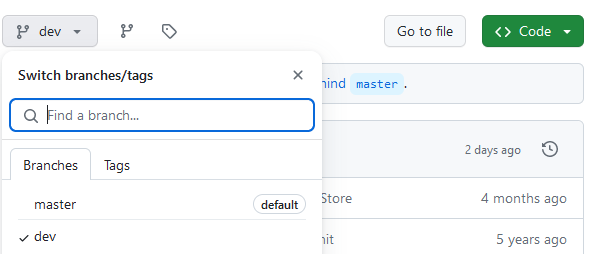

# Floodplain and Channel Evaluation Tool (FACET)

This is FACET repo for continuous development (CD) and the published FACET 0.1.0 code can be accessed [here](https://code.usgs.gov/water/facet). The FACET-CD on `dev` will function and perform much differently compared to the original published model. Once, we reach a satisfactory point with CD, we will merge the `dev` branch into `master` and subsequently publish the data, so use with caution and do not publish the outputs.

The repo has two branches `master` and `dev`. The master branch is similar to published code to keep up with library/module and environment updates along with any deprecated behaviors, and the `dev` branch is for experimental features/CD development.

## Getting started with FACET 0.2

Before getting started download the following softwares/applications (instructions to install are also listed on the same page):
- [Miniconda3](https://docs.anaconda.com/free/miniconda/index.html) (if you have anaconda please feel free to use it as well)
- [TauDEM](http://hydrology.usu.edu/taudem/taudem5/downloads.html) version 5.3.7, including the TauDEM dependencies. [**This might be not necessary, if you are able to install taudem as part of a conda environment below. If you are experiencing any issues with installing taudem as conda package then you will need to install Taudem and its dependencies from the link above**]
- [GitHub Desktop](https://desktop.github.com/) or git client of your choice. If you are unfamiliar with git, see alternate options below.


## Steps:

1. Install `Miniconda3`
2. Install git or GitHub Desktop or any other client (using one of the following methods):
        a. On `GitHub Desktop`, `File > Clone repository > url`. Copy and paste the url for the repo (`https://github.com/lahm3d/facet.git`), select the location and click clone. Don't forget to change the branch to `dev` from `master`
        b. Git bash: `https://github.com/lahm3d/facet.git - b dev`
        c. Navigate to `https://github.com/lahm3d/facet`, change branch from `master` to `dev`(see below), and click on `code` and then click on download. This will download the repository. Unzip to your desired location



3. Installing the conda environment: The default conda environment yaml file includes taudem package, so you don't have to install it separately. However, taudem sometimes breaks conda environment, so here two two routes for installation. We recommend you try (a) to see if the conda breaks the environment, if it does then opt for option (b):
        a. Open miniconda3 shell or command prompt and type the following to create the environment: 
                         `conda env create -f  C:/.../facet/environment.yml`
        b. If the Miniconda3 environment creation fails, then open the yaml file and comment out the line (by adding hashbang e.g., `#  -taudem=5.3.8`). Next, rerun the command in step 3a `conda env create -f C:/.../facet/environment.yml`, and install `taudem` separately as listed on their original website.

4. Download sample data to test FACET installation and to familiarize yourself with directory structure facet uses
        - Download the data from here:`https://gis-data.chesapeakebay.net/facet_misc_data/draft.zip`
        - Unzip and place it outside of facet code repository

5. Facet is all set up and ready to run. See the next section to see how to modify the config file and once you are done with modifications, you are ready to run FACET


## Running FACET:

Open the config file located `C:/.../facet/src/config.toml` in any text editor (**use forward slash '/' for all file paths in the config**
):

-`batch_csv` : Either "None" or a custom csv file where you can enter huc-id numbers to process, and to skip. Use the `facet/batch.csv` template file and modify as needed. It does not matter where the file is located.
-`huc`: Either "None" or a HUC code to process if a CSV file is not provided

- `ancillary`: 
        - Input paths for all the ancillary data which have been converted to geoparquet and stored on s3. **Use the default paths for the files.**
        - Update `data` variable to location of the unzipped draft data e.g., if you unzipped draft data in `C:/draft` then that's what should be under `data` 
        - `streams`: streams or flowlines if you are using existing stream network 
        - `nhd_area`: NHD area
        - `nhd_waterbody`: NHD waterbody
        - `nhd_physiography`: Physiography file
        - `census_roads`: Census 2023 roads
        - `census_rails`: Census 2023 rails
		- `cutlines`: Optional vector of cutlines to burn into DEM


Modify the config file by navigating to `/.../facet/src/config.toml` (see below for how to use the configuration file). Now to run facet type: `python /.../facet/facet.py`

### Download sample data: 

Navigate to `facet/src/config.toml` and edit the following values:

`batch_csv` : Either "None" or a custom csv file where you can enter huc-id numbers to process, and to skip. Use the `facet/batch.csv` template file and modify as needed. It does not matter where the file is located.
`huc`: Either "None" or a HUC code to process if a CSV file is not provided

`ancillary`: Input paths for all the ancillary data which have been converted to geoparquet and stored on s3. Use the default paths for the files.

`data`: Location of your data folder where you will be organizing all your watershed folders. This folder needs to be created manually.

`debug` and `version` allows users to run facet multiple times with parameter settings. If you want to run facet with two separate settings then you can modify the `version` variable to a descriptive string

`preprocess_flag`: determines whether preprocessing will be completed or previously generated outputs will be used, true or false
`preprocess_version`: Name of alternative version where preprocess outputs are located if "preprocess_flag: true"

`preprocess.burn_cutlines_flag`: determines whether cutlines will be burned into DEM, true or false

`preprocess.burn_stream_at_roads_flag`: determines whether DEM will be burned where roads/rails cross streams, true or false
`preprocess.burn_stream_at_roads`: no. of cells to burn NHD streams near road + rail and stream intersections

`preprocess.denoise_flag`: determines whether DEM will be denoised, true or false
`preprocess.denoise`: Whitebox [feature preserving smoothing]() algorithm with defaults set

`preprocess.breach_depression_least_cost`: Whitebox [Breach Depressions Least Cost](https://www.whiteboxgeo.com/manual/wbt_book/available_tools/hydrological_analysis.html?highlight=breaching%20lease#breachdepressionsleastcost).

`preprocess.taudem.network_method`: Determine whether stream initiation weights or drainage area thresholds are used to generate stream network, should be'area_threshold' or 'flowline_weights'
`preprocess.taudem.threshold`: Drainage area threshold for stream network generation in number of cells (be cognizant of raster resolution)

`reuse_xn_flag`: determines whether previously-generated cross-sections will be used, true or false
`reuse_xn_data`: the data directory (containing a version subdirectory) in which the previously generated channel and floodplain cross sections are located if "reuse_xn_flag: true"
`reuse_xn_version`: Name of alternative version in which the previously generated channel and floodplain cross sections are located if "reuse_xn_flag: true"


`xn_gap`: Gap between each cross-section. This is not consistent, usually for first ~2-4 cross-sections on every reach to ensure whole number of cross-sections are generated consistently.

`xn_slope_vertical_cutoff`: Cross-section slope vertical cutoff. No need to modify unless modifying behavior of orthogonal angles.

`xn_lengths.channel` and `xn_lengths.floodplain`: Channel and floodplain cross-section lenghts. The `xn_len` refers to length of a cross-section on one side e.g., a first order stream will have a `40` meter long  channel cross-section and a `100` meter long floodplain cross-section. No need to modify `pf_len`.

`methods.curvature`: Modify curvature parameters and the dimensions of the curvature window now can be modified based on stream order


### Sample data
The folder structure has been reorganized but not finalized. If no version is provided in the config then all the files under `ver-1` will be created in the master folder.
```
└── huc_020600031001
    ├── 020600031001_dem.tif
    ├── 020600031001_flowlines.shp
    ├── 020600031001_hs.tif
    ├── 020600031001_watershed.shp
    └── ver-1
        ├── 020600031001_rr_crossings_ver-01.shp
        ├── 020600031001_burn_crossings_ver-01.tif
        ├── 020600031001_denoise_ver-01.tif
        ├── 020600031001_initiation_pixels_ver-01.tif
        ├── 020600031001_breach_ver-01.tif
        ├── 020600031001_slope_grid_sd8_ver-01.tif
        ├── 020600031001_d8_fdir_point_ver-01.tif
        ├── 020600031001_area_grid_ad8_ip_ver-01.tif
        ├── 020600031001_area_grid_ad8_ver-01.tif
        ├── 020600031001_network_coords_ver-01.dat
        ├── 020600031001_network_ver-01.shp
        ├── 020600031001_network_tree_ver-01.dat
        ├── 020600031001_sub_watersheds_ver-01.tif
        ├── 020600031001_network_order_ver-01.tif
        ├── 020600031001_slope_grid_dinf_ver-01.tif
        ├── 020600031001_flow_dir_dinf_ver-01.tif
        ├── 020600031001_hand_ver-01.tif
        └── 020600031001_sub_watersheds_ver-01.shp
```

To run facet, first open miniconda window:

        cd c:/folder-where-you-cloned-or-unzipped-facet-repo
        conda activate facet
        python src/facet.py --config_toml "src/config_test.toml" --fpaths_toml "src/utils/filepaths.toml"


## Reporting bugs
Please consider reporting bugs and asking questions on the code.usgs.gov/FACET Issues page: [https://code.usgs.gov/water/facet/issues](https://code.usgs.gov/water/facet/issues). Users can also email questions to facet@usgs.gov.

## Acknowledgements

Funding for FACET was provided by a grant from the William Penn Foundation Delaware Watershed Research Fund and the U.S. Geological Survey.

## References

<a name="1">1</a>: C. Gangodagamage et al., "Wavelet-Compressed Representation of Landscapes for Hydrologic and Geomorphologic Applications," in IEEE Geoscience and Remote Sensing Letters, vol. 13, no. 4, pp. 480-484, April 2016.
doi: 10.1109/LGRS.2015.2513011

## Disclaimer

This software has been approved for release by the U.S. Geological Survey (USGS). Although the software has been subjected to rigorous review, the USGS reserves the right to update the software as needed pursuant to further analysis and review. No warranty, expressed or implied, is made by the USGS or the U.S. Government as to the functionality of the software and related material nor shall the fact of release constitute any such warranty. Furthermore, the software is released on condition that neither the USGS nor the U.S. Government shall be held liable for any damages resulting from its authorized or unauthorized use.

## License

This software is licensed under [CC0 1.0](http://creativecommons.org/publicdomain/zero/1.0/) and is in the [public domain](https://en.wikipedia.org/wiki/Public_domain) because it contains materials that originally
came from the [U.S. Geological Survey (USGS)](https://www.usgs.gov/), an agency of the [United States Department of Interior](https://www.doi.gov/). For more.
information, see the [official USGS copyright policy](http://www.usgs.gov/visual-id/credit_usgs.html#copyright/).


