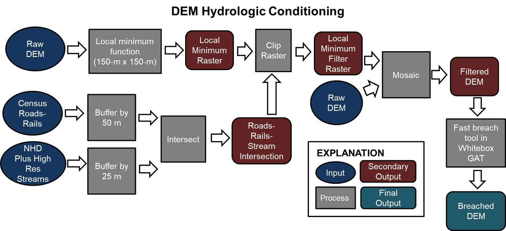

# Floodplain and Channel Evaluation Tool (FACET)

This is FACET repo for continuous development (CD) and the published FACET 0.1.0 code can be accessed [here](https://code.usgs.gov/water/facet). There will be large gaps between published and CD repositories in terms of environment, behavior and algorithms. Once we reach a satisfactory point, we will publish the code on `https://code.usgs.gov`.

The repo has two branches `main` and `dev`. The main branch is similar to published code to keep up with library/module and environment updates along with any deprecated behaviors.

---

## Table of Contents:
 * [Citation](#citation)
 * [Introduction](#introduction)
    * [Background](#background)
    * [Hydrologic Conditioning](#hydrologic-conditioning)
    * [Stream Network Delineation](#stream-network-delineation)
    * [Stream Bank Detection](#stream-bank-detection)
    * [Mapping Floodplain Extent](#mapping-floodplain-extent)
    * [Calculating Channel and Floodplain Metrics](#calculating-channel-and-floodplain-metrics)
    * [Limitations of FACET](#limitations-of-facet)
 * [Getting Started with FACET](#getting-started-with-facet)
    * [Install prerequisite applications](#install-prerequisite-applications)
    * [Install FACET and Configure Environments](#install-facet-and-configure-environments)
    * [Obtain Ancillary Datasets](#obtain-ancillary-datasets)
    * [Setup the Directory Structure](#setup-the-directory-structure)
    * [Edit Parameters in the Configuration File](#edit-parameters-in-the-configuration-file)
    * [Guide to Configuration Parameters](#guide-to-configuration-parameters)
    * [Run FACET](#run-facet)
 * [FACET Output Files](#facet-output-files)
 * [FAQs](#faqs)
 * [Reporting Bugs](#reporting-bugs)
 * [Acknowledgements](#acknowledgements)
 * [References](#references)
 * [Disclaimer](#disclaimer)
 * [License](#license)

***

## Citation
Lamont, S., L. Ahmed, M.J. Metes, P. Claggett, K.G. Hopkins, G.B. Noe. (2019). Floodplain and Channel Evaluation Tool (FACET). Version 0.1.0. [Software release]. U.S. Geological Survey. DOI: [https://doi.org/10.5066/P9PI94Z1](https://doi.org/10.5066/P9PI94Z1).

## Introduction
### Background
FACET is a Python tool that uses open source modules to map the floodplain extent and derive reach-scale summaries of stream and floodplain geomorphic measurements from high-resolution digital elevation models (DEMs). Geomorphic measurements include channel width, stream bank height, floodplain width, and stream slope. 

Current tool functionality is only meant to process DEMs within the Chesapeake Bay and Delaware River watersheds. FACET was developed to batch process 3-m resolution DEMs in the Chesapeake Bay and Delaware River watersheds. Future updates to FACET will allow users to process DEMs outside of the Chesapeake and Delaware basins. 

FACET allows the user to hydrologically condition the DEM, generate the stream network, select one of two options for stream bank  identification, map the floodplain extent using a Height Above Nearest Drainage (HAND) approach, and calculate stream and floodplain metrics using three approaches. 

### Hydrologic Conditioning
Hydrologic conditioning is necessary to ensure the proper routing of flow downstream within the DEM. FACET hydrologically conditions the DEM using ancillary U.S. Census data on the location of roads and railroads. FACET breaches through road and railroad culverts replacing the elevation in the RawDEM with an elevation derived from a local minimum filter. 

The local minimum value is derived by first buffering roads and railroads by 50 m and streams by 25 m. The buffered roads-rails polygon and buffered stream polygon are intersected to identify potential locations where breaching is necessary. Then a local minimum raster is created from the RawDEM using a local minimum function with a 150-m by 150-m window. The local minimum raster is then clipped to the intersected road-rail-stream layer to create a local minimum filter raster. The local minimum filter raster is then mosaicked with the original RawDEM and run through the fast breach tool in Whitebox Tools to create the final breached DEM.

### Stream Network Delineation
FACET generates the stream network using the beached DEM and TauDEM Basic Grid Analysis tools. The breached DEM is first filled using the TauDEM Pit Removal Tool. The breached filled DEM is then run through the TauDEM D8 Flow Directions Tool to generate a D8 flow direction grid. 

The location of the National Hydrography Dataset Plus High Resolution (NHDPlus-HR) streams are then used to extract the coordinates of streamline endpoints representing the location of headwater stream initiation points. Headwater initiation points are then used to create a stream initiation raster with the same extent and resolution of the breached DEM and a pixel value of 1 for pixels that overlap with stream initiation points and 0 everywhere else. 

The TauDEM D8 Contributing Area Tool is then used to generate a weighted contributing area grid from the D8 flow direction grid with the stream initiation raster as weights. Lastly, the TauDEM Stream Reach and Watershed Tool is used to generate the stream network from the weighted D8 contributing area grid and stream network attributes (e.g., Strahler order, length, slope, drainage area). FACET outputs the stream network in raster (`XXX_network.tif`) and vector (`XXX_network.shp`) formats. 

### Stream Bank Detection
FACET provides two options for identifying stream banks in the DEM: 

1.  Slope break approach using cross-sections
2.  Wavelet curvature approach using a moving window and curvature threshold [1](#1)

**Slope Break Approach**: The slope break approach uses a series of cross sections to extract channel profiles and identify bank point locations based on a slope threshold. FACET generates cross sections intersecting perpendicular to the channel and spaced 9 m apart along the stream network. FACET cross section length varies from 20 m for first order streams to 150 m for sixth order or higher streams. Within each cross section, FACET draws a series of horizontal lines spaced at a user specified vertical increment (`parm_ivert` = default 0.2 m) and user specified point spacing (`p_xngap` = default 3 m). When the length of the next higher vertical line exceeds the `parm_ratiothresh` (default 1.5) FACET searches for a slope between the measurement points that exceeds the slope threshold (`parm_slpthresh` = default 0.03 or 3%). FACET creates a bank point at this location. All user specified parameters for the slope break approach are entered into the FACET config file under  `[cross section method]`. FACET outputs bank points as a file called, `bankpoints_1D_metrics.shp`.

**Wavelet curvature approach**: The wavelet curvature approach currently requires using a 3-m resolution DEM. FACET calculates curvature within a moving window that traverses the stream network at a user specific length (`i_step` = default 100 m). A local curvature threshold (`max_buff` = default 30 m) is then used to identify grid cells representing the bank. If use_wavelet_curvature_method is set to false FACET uses a mean curvature approach, rather than the wavelet-based approach. The mean curvature approach calculates a profile slope in 8 cardinal directions and then uses a square moving window along the channel to identify cells that exceed 30% of the range of values within the window. These cells are identified as bank pixels. The dimension of the moving window used were 20 cells (60 m x 60 m) for streams with an order less than 5, 40 cells (120 m x 120 m) for 5th order, and 80 cells (240 m x 240 m) for streams of order 6 or greater. All user specified parameters for the slope break approach are entered into the FACET config file under `[width from curvature via buff. method]`. FACET outputs bank pixels as a file called, `xxx_bankpixels.tif`.  

### Mapping Floodplain Extent
FACET was developed to map the active (field-defined) floodplain extent for wadeable streams within the Chesapeake and Delaware River watersheds. The active floodplain extent is mapped using a height above nearest drainage (HAND) threshold that was calibrated to match field measured floodplain widths from 57 sites within the Chesapeake and Delaware watersheds. FACET creates a HAND grid using the TauDEM D-infinity distance down (vertical average) tool. The inputs to the distance down tool are the FACET generated stream network and the D8 flow direction grid. 

A linear regression model is then used to identify the appropriate HAND threshold to use for each location to map the active floodplain extent. Any pixel less than the HAND threshold would be identified as floodplain and any pixel greater than the HAND threshold is non-floodplain. A static HAND threshold was used within the coastal plain (HAND = 1.65 m) and blue ridge (HAND = 1.56 m). A linear regression equation was used to identify the HAND threshold for sites within the piedmont, valley and ridge, and appalachian plateau. The regression equation included physiographic province and drainage area as the predictor variables.

FACET generates floodplain grids for streams with drainage areas greater than 3 km2 and less than 3000 km2. This range of drainage areas was selected to match the range in drainage areas for the field sites used for calibration of the linear regression equation. FACET outputs the floodplain extent as a raster called, `xxx_floodplain.tif`.

### Calculating Channel and Floodplain Metrics
FACET outputs three types of stream and floodplain metrics: 

**1-D Metrics:** The 1-D metrics use the output from the stream bank detection slope break approach to determine channel width (`chan_width`), bank height (`bankht_1d`), and floodplain width (`fpwid_1d`) at each cross section. These metrics are summarized in the FACET output files `bankpoints_1D_metrics.shp` and `floodplain_xns_1D_metrics.shp.`

**2-D Metrics:** The 2-D metrics use bank pixel output (FACET ouptput file `[folder name]_bankpixels.tif`) from the stream bank detection wavelet curvature approach and a user specified buffer (config file `max_buff` parameter in [width from curvature via buff. method]) to estimate channel width (`chnwid_px`) by iteratively draw lines outward parallel to the channel and finding the lines with the most channel pixels in each buffer. These metrics are summarized in the FACET output file `channel_floodplain_2D_metrics.shp.`

**2-D HAND Metrics:** The 2-D HAND metrics use the HAND grid and a moving window to take vertical slices of the HAND profile to identify a slope break marking the location of the stream banks. FACET the calculates the channel width (`chnwid_2dh`) and floodplain width (`fpwid_2dh`). These metrics are summarized in the FACET output file `channel_floodplain_2D_metrics.shp.`

### Limitations of FACET 

The accuracy of FACET output depends on the quality and resolution of the DEM used. The user should not interpret FACET stream and floodplain geomorphic measurements as a replacement for on-the-ground measurements of geomorphic characteristic. Rather, FACET provides a tool to rapidly assess patterns in geomorphic characteristics at a regional scale. Any FACET output should be screened for outliers and abnormalities. 

## Getting Started with FACET
**Outline of Steps:**
1. Install prerequisite applications 
2. Install FACET and configure environments
3. Obtain ancillary datasets
4. Setup directory structure
5. Edit the parameters in the configuration file
6. Run FACET

### Install prerequisite applications
* Download and install the latest version of [Anaconda](https://docs.anaconda.com/anaconda/install/) for python. FACET was developed and tested using Conda version 4.2.17.
* Download and install [TauDEM](http://hydrology.usu.edu/taudem/taudem5/downloads.html) version 5.3, including the TauDEM dependencies.
* Download and install [R](https://www.r-project.org/) version 3.6.1.
* Download and install [git](https://gitforwindows.org/). Downloading git is optional, but highly recommended for accessing code updates.

**Note on Whitebox Tools**

[WhiteboxTool (WBT)](https://www.uoguelph.ca/~hydrogeo/software.shtml#wgat) is a standalone open source swiss army knife of geospatial tools supported by Dr. John Lindsay at University of Guelph, Canada. FACET uses WBT’s algorithms for various pre-processing steps for hydrologically conditioning the DEMs. WhiteboxTools is installed while setting up the facet environment on Anaconda. No additional steps are needed for installation.

### Install FACET and Configure Environments 
**Step 1:** Identify where to store FACET code and the data on your local machine. In this tutorial, the code and data will be saved under c:\chesapeake_bay.

**Step 2:** Download FACET using one of the two options listed below.

Option 1 - Download FACET files from code.usgs.gov and extract all the files under `c:\chesapeake_bay.`

Option 2 -  Clone the FACET repository from Git

Open 'git bash' window from your Windows Start button and navigate to the folder where you would like to add FACET by typing ‘cd’ followed by the path:

        cd c:\chesapeake_bay

Now download FACET code by typing:

        git clone https://code.usgs.gov/water/facet.git

**Step 3:** Configure the FACET Python environment.

Open the Window's Start button, type 'Anaconda Prompt' and launch the prompt. Next type in the following cmd line to navigate to the c:\chesapeake_bay\FACET folder:

        cd c:\chesapeake_bay\facet

Now create a unique environment for FACET, by typing the following command:

        conda env create -f c:\chesapeake_bay\FACET\facet_env.yml

This creates a new environment called ‘facet_env’ and installs all the relevant packages needed. After launching the Anaconda prompt the window displays:

        (base) C:\chesapeake_bay\FACET>

"base" is the base environment that is currently active, you need to switch from base to facet_env. Switch from “base” to the “facet_env” environment by typing: 

        conda activate facet_env
  
Now the prompt should display:

        (facet_env) C:\chesapeake_bay\FACET>

This means that the user successfully activated the FACET environment. The user should now obtain ancillary datasets and setup the file directory structure.

Note for Department of Interior (DOI) Users: See FAQs for assistance errors setting up the FACET environment or certificates.

### Obtain Ancillary Datasets 
Users need to acquire the following datasets. 
* Digital elevation model (DEM) of the study area saved as a .tif (resolution 3-m) and labeled as watershedid_dem.tif (for example, 0207000508_dem.tif)
* Shapefile with a mask of the DEM extent and labeled as watershedid_mask.shp (for example, 0207000508_mask.shp)

Users will also need to obtain the following ancillary datasets that are provided for the Chesapeake and Delaware Basins. The user has the option to either manually download these files from [USGS ScienceBase](https://www.sciencebase.gov/catalog/item/5cddaefee4b02927374637a9) and place them under c:\chesapeake_bay\ancillary_data, or run the setup.py script provided as part of FACET. If manually downloading ancillary data, the user needs to ensure that the file paths in the configuration file point to the appropriate ancillary data folders and files. 
* Physiographic regions (shapefile). Downloadable from [https://www.sciencebase.gov/catalog/item/5d94949de4b0c4f70d0db64f](https://www.sciencebase.gov/catalog/item/5d94949de4b0c4f70d0db64f)
* Census All Roads, 2018 (shapefile). Downloadable from [https://www.sciencebase.gov/catalog/item/5d949474e4b0c4f70d0db64a](https://www.sciencebase.gov/catalog/item/5d949474e4b0c4f70d0db64a)
* Census Rails, 2018 (shapefile). Downloadable from [https://www.sciencebase.gov/catalog/item/5d949474e4b0c4f70d0db64a](https://www.sciencebase.gov/catalog/item/5d949474e4b0c4f70d0db64a)
* NHD high-resolution flowlines and waterbodies (shapefiles). Downloadable from [https://www.sciencebase.gov/catalog/item/5d949489e4b0c4f70d0db64d](https://www.sciencebase.gov/catalog/item/5d949489e4b0c4f70d0db64d)

**Running FACET setup script**

To simplify downloading ancillary datasets, FACET has a simple setup.py script. The script downloads ancillary data for the Chesapeake Bay and Delaware River watersheds, creates folder structures, and updates the configuration file with file paths. This will download and organize regional ancillary datasets under c:\chesapeake_bay\ancillary data. The run time for this step is roughly 20-45 minutes, depending on internet connection speed. 

If any of the ancillary files fail to download or extract with the setup script, the user should re-run the setup script, or go to ScienceBase and manually download the files that failed.

Run the setup script in the Anaconda prompt by typing:

        python setup.py -p C:\chesapeake_bay

### Setup the Directory Structure
Below is the suggested directory structure for FACET input data. This structure outlines where input files should be saved. The users should aim to structure their project directories accordingly. 

        c:\chesapeake_bay
            ├── facet (git repository)
            ├── ancillary_data 
            |       ├── 0204.shp
            |       ├── 0204_waterbody.shp
            |       ├── 0205.shp
            |       ├── 0205_waterbody.shp
            |       ├── 0206.shp
            |       ├── 0206_waterbody.shp
            |       ├── 0207.shp
            |       ├── 0207_waterbody.shp
            |       ├── 0208.shp
            |       ├── 0208_waterbody.shp
            |       ├── census_rails_2018_mid_atlantic.shp
            |       ├── census_roads_2018_mid_atlantic.shp
            |       ├── physiographic_regions_cbw.shp
            |       └── physiographic_regions_drb.shp
            └── sample_data 
                    └── 0207000508
                         ├── 0207000508_dem.tif
                         └── 0207000508_mask.shp

**facet** This is the folder where FACET was downloaded.

**ancillary_data** This is the folder that contains all ancillary data. It will be automatically created and populated with the necessary data for running FACET in the Chesapeake Bay and Delaware River watersheds if running the setup.py script.

**sample_data** This is the folder that contains all DEM and watershed mask data. A sample dataset is provided to quickly test run FACET, but will need to be [manually downloaded from ScienceBase](https://www.sciencebase.gov/catalog/item/requestDownload/5c8829e3e4b09388244d01d7?filePath=__disk__10%2F86%2F40%2F10864048d994f7664d5068b4b09ba47b8c14a53f). 
It is **highly recommended that the user does a test run with the sample data** prior to running FACET on a user supplied DEM. 

The same directory structure will be used if the users has one DEM or multiple DEMs. If multiple DEMs will be used, the user should create a seperate folder within sample_data for each DEM and mask, and label the folder with the same watershed ID as the DEM and mask files.

### Edit Parameters in the Configuration File
FACET uses the configuration file called config.ini to define file paths, toggle features, and set parameters values. This config file can be opened in any text editor. It is highly recommended that the user create a copy of the original file and rename it as config_orig.ini, to maintain an original config file backup. FACET will always search for a file name config.ini so make sure the updated config file has the name config.ini.

The users will need to make edits to the config.ini to run FACET on their computer. It is recommended that users **ONLY** modify the following sections: file paths, breach options, skip HUCs, spatial ref, and post processing, and leave all other values as defaults. Future versions of FACET will provide guidance and additional documentation on how to set other config parameters.

Here is an example of the config file. Carefully read the next section on how to edit the configuration file.

        [config info]
        description : 'FACET configuration file. For comments use  (;) and paths accept both forward or backward slash'

        [file paths]
        # Check that file path locations are correct
        data_dir : c:\chesapeake_bay\sample_data
        ancillary dir : c:\chesapeake_bay\ancillary_data
        physio cbw : c:\chesapeake_bay\ancillary_data\physiographic_regions_CBW.shp
        physio drb : c:\chesapeake_bay\ancillary_data\physiographic_regions_DRB.shp
        census roads : c:\chesapeake_bay\ancillary_data\census_roads_2018_mid_atlantic_states.shp
        census rails : c:\chesapeake_bay\ancillary_data\census_rails_2018_mid_atlantic_states.shp

        [spatial ref]
        # Provide the spatial reference for raster and vector files. 
        # FACET only accepts PROJ.4 (proj4) strings for defining the projections.
        # A default spatial reference is provided for the Chesapeake and Delaware River watersheds.
        crs : +proj=aea +lat_1=29.5 +lat_2=45.5 +lat_0=23 +lon_0=-96 +x_0=0 +y_0=0 +datum=NAD83 +units=m +no_defs

        [skip HUCs]
        # Leave blank if running FACET on DEMs in all HUC folders within the sample_data folder.  
        # To skip running FACET on specific folders within the sample_data the user can list the folder names separated by commas without any spaces or list of folder names in a .csv (e.g., 0207000508,0207000507). 
        skip_list : 

        [pre process dem]
        # Toggle DEM pre processing on and off using True or False.
        taudem : True
        taudem cores : 2
        wt_grid : True
        resample resolution : 3

        [breach options]
        # Toggle beaching options on and off using True or False
        pre-condition dem & fast-breach : True
        fast-breach : False

        [reach and order]
        # Do not modify
        reach_id : LINKNO
        order_id : strmOrder

        [cross section method]
        # Default parameters are provided to run FACET on 3-m DEMs within the Chesapeake and Delaware River watersheds.
        parm_ivert : 0.2
        parm_ratiothresh : 1.5
        parm_slpthresh : 0.03
        p_xngap : 3

        [width from curvature via buff. method]
        # Toggle “use_wavelet_curvature_method” on or off using True or False. 
        use_wavelet_curvature_method : True
        i_step : 100
        max_buff : 30

        [post processing]
        # Toggle post process on and off using True or False. 
        # r exe path. The user must update to the correct path location for RScipt.exe. This can be found by running R.home() in R.
        # Toggle “clean” on or off using True or False. 
        # Toggle “archive”  on or off using True or False. 
        post process : True
        stream buffer : 60
        r exe path : C:\Program Files\R\...\bin\RScript.exe # Needs updated to reflect where RScript.exe is saved on the user's computer.
        clean: False
        archive: False

### Guide to Configuration Parameters

**File paths**

`data_dir` : the file path for the location of the folder containing the DEMs. The default file path is `c:\chesapeake_bay\sample_data`.

`ancillary dir` : The file path for required ancillary data. The default file path is `c:\chesapeake_bay\ancillary_data`.

`physio cbw` : The file path for the physiographic province layer for the Chesapeake Bay watershed. The default file path is `c:\chesapeake_bay\ancillary_data\physiographic_regions_CBW.shp`.

`physio drb` : The file path for the physiographic province layer for the Delaware River watershed. The default file path is `c:\chesapeake_bay\ancillary_data\physiographic_regions_DRB.shp`.

`census roads` : The file path for Census roads. The default file path is `c:\chesapeake_bay\ancillary_data\census_roads_2018_mid_atlantic_states.shp`.

`census rails` : The file path for Census railroads. The default file path is `c:\chesapeake_bay\ancillary_data\census_rails_2018_mid_atlantic_states.shp`.

**Spatial ref**

`crs` : Sets the spatial reference. FACET only accepts PROJ.4 (proj4) strings for defining the projections. Users can provide proj4 string of their choice and all the datasets will be transformed to the new projection system. The new projection should be a projected coordinate system (PCS), not a geographic coordinate system (GCS). The input files can retain their native projections because each file will be reprojected to the spatial reference set in the configuration file. A default spatial reference is provided for the Chesapeake and Delaware River watersheds using the proj4 for USA Contiguous Albers Equal Area Conic (PCS): 

        
        +proj=aea +lat_1=29.5 +lat_2=45.5 +lat_0=37.5 +lon_0=-96 +x_0=0 +y_0=0 +datum=NAD83 +units=m +no_defs.

**skip HUCs**

`skip_list` : Skip HUCs functionality allows the user to run FACET on specific folders within the file directory structure. To exclude specific HUC folders, the user can either manually enter the HUC folder names separated by commas or list the file path of a .csv file with a list of HUCs (with no header and comma separated).

**pre process dem**

`taudem` : Enable (True) or disable (False). Default is enabled. Parameter enables or disables TauDEM pre processing steps. Disabling will fail to generate any pre-processing files needed for FACET. The toggle is useful for re-running FACET without needing to also re-run all the pre processes steps. 

`taudem cores` : Parameter to set the number of cores TauDEM can use for generating pre processing files. If you experience performance issues reduce the number of cores. Default is set at 2.

`wt_grid` : Enable (True) or disable (False). Default is enabled. Parameter to toggle the creation of a weight grid from NHD stream lines. Disabling will fail to generate `*_wg.tif` an important input for pre-processing steps. The toggle is useful for re-running FACET without needing to also re-run all the pre processes steps. 

`resample resolution` : The input is integer and the default is set to 3 meters. The units are always in meters. This parameter is the resolution to which the user wants the DEM resampled to. FACET uses ‘resample resolution’ to set the cross-section point distances parameter i.e. ‘xnptdist’. This ensures bank point spacing aligns with the DEM’s resolution.

**breach options**

The user can select one of two DEM breaching methods.
1. `pre-condition dem & fast-breach` : Enable (True) or disable (False). The default is enabled. The DEM is hydrologically conditioned to allow fast-breach algorithm to breach through the roads and railroads that are provided in the ancillary data. 
2. `default wbt breach mt`d : Enable (True) or disable (False). The default is disabled. If enabled FACET will run Whitebox Tools’ default fast-breach algorithm. No ancillary data are needed for this approach. Note that this breach method may generate artificial stream paths and the user should review the stream layer out for potential errors.

**reach and order**

`reach_id` : Unique identifier for stream reaches. The default is set to LINKNO. Do not modify.

`order_id` : Unique identifier for stream order. The default is set to strmOrder. Do not modify.

**cross section method**

These parameters are used in the 1D Slope Break Approach method for stream bank detection.

`parm_ivert` : Within each cross section, FACET draws a series of horizontal lines spaced at this user specified vertical increment. Value is in meters. The default is set to 0.2.

`parm_ratiothresh` : When the length of the next higher horizontal lines segment exceeds `parm_ratiothresh`, FACET searches for a slope between the measurement points that exceeds the slope threshold (`parm_slpthresh`). Value is in meters. The default is set to 1.5.

`parm_slpthresh` : Slope break threshold. The default is set to 0.03 (3% slope). 

`p_xngap` : Point spacing across the length of each horizonal line segment. Point spacing should not be smaller than the resolution of the DEM. Value is in meters. The default is set to 3. 

**width from curvature via buff. method**

These parameters are used in the 2D Wavelet Curvature Approach for stream bank detection.

`use_wavelet_curvature_method` : Enable (True) or disable (False). If enabled FACET uses the Wavelet Curvature Approach for stream bank detection. If disabled FACET uses mean curvature for bank detection. The default is enabled.

`i_step` : Length of the moving window used to traverse the stream network for curvature calculations. Value is in meters. The default is set to 100. 

`max_buff` : The maximum distance out from the stream segment, applied to the right and left side of the stream, where buffer segments will search for the stream banks. The value is in meters. The default is set to 30. 

**Post-process:**

`post process` : Enable (True) or disable (False). The default is enabled. Post process as True will aggregate floodplain and channel metrics from individual cross sections to the reach-scale. Post process as False will skip this step.

`stream buffer` : Define stream width needed for post processing steps. The input is in Meters. The default is set to 60 meters.

`r exe path` : Complete path to RScript.exe. **The user will need to update the default** which is set to `C:\Program Files\R\...\bin\RScript.exe`. To quickly find the correct file path run the function `R.home()` in R.

`clean` : Enable (True) or disable (False). The default is disabled. Clean as True will delete all intermediate files. Clean as False will save all intermediate files within the folder structure.

`archive` : Enable (True) or disable (False). The default is disabled. Archive as True will archive the entire HUC folder as a .zip file.  

###  Run FACET
After successfully running the setup script, updating the config file, and organizing the data folder you can execute FACET using command line by typing in the Anaconda Prompt:

      (facet_env) C:\chesapeake_bay\FACET>python facet.py

## FACET Output Files
FACET saves all output files to the watershedID folder within the sample_data folder. Files from the FACET post-processing step are saved a new folder called post processing saved within the watershedID folder.
Below is the directory structure for FACET output for the post-processing step. The post-processing outputs provide stream channel and floodplain metric summaries for each stream-reach segment.  

A data dictionary is provided describing all FACET output files and attributes. Please refer to the data dictionary for these details.

        c:\chesapeake_bay
        └── sample_data 
                └── 0207000508
                        ├── post_processing
                        |       ├── bankpoints_1D_metrics.shp
                        |       ├── bankpoints_1D_metrics_all_stats.dbf
                        |       ├── floodplain_xns_1D_metrics.shp
                        |       ├── floodplain_xns_1D_metrics_all_stats.dbf
                        |       ├── channel_floodplain_2D_metrics.shp
                        |       ├── channel_floodplain_2D_metrics_all_stats.dbf
                        |       ├── tmp_outside_buffer.shp
                        |       ├── tmp_streams_inside_waterbodies.shp
                        |       ├── tmp_streams_outside_nhd_buff.shp
                        |       └── tmp_water_bodies.shp
                        ├── 0207000508_bankpixels.tif
                        ├── 0207000508_channel_xns.shp
                        ├── 0207000508_floodplain.tif
                        ├── 0207000508_hand.tif
                        ├── 0207000508_network.tif
                        ├── 0207000508_network.shp
                        .
                        .
                        .
   
## FAQs

### Can users run FACET outside of the Chesapeake or Delaware basin?
The current version of FACET can only be run on DEMs within the Chesapeake and Delaware Basins. Future versions of FACET will allow processing DEMs outside of the Chesapeake and Delaware basins. 

### Do users have to use a 3-m resolution DEM?
FACET currently requires using a 3-m resolution DEM or using a higher resolution DEM (e.g., 1-m) that will be resampled by FACET to 3-m. Future versions of FACET will allow the user to use DEMs of higher and lower resolution. 

### What operating system can FACET run on?
FACET was written in python and can be run on Linux and Windows operating systems, but Windows is the preferred system. FACET relies on TauDEM for hydrologically conditioning the DEMs and the TauDEM runs on a Windows operating system. Additionally, post-processing steps were written in python and R.

### Why does FACET work best on watersheds no larger than HUC 10?
FACET can be implemented on larger watersheds such as HUC 8, but for reasonable computational processing time and scalability HUC 10 watersheds were selected as the optimal size. Currently, only the hydrologic conditioning processing using TauDEM can take advantage of multiple cores. Upgrading FACET's ability to run in parallel is underway, but not currently available.

### How long does it take FACET to successfully process a HUC 10 watershed?

    Operating System: Windows 10
    Hardware: 
        CPU: Intel i7 2.9 GHz (4 cores & TauDEM core process set to 2)
        Memory: 16 GB RAM

The average run times for a single HUC 10 are 30 minutes (including pre-processing and post-processing steps)

### What information does FACET output contain?
FACET generates a series of rasters, shapefiles, and attribute tables for streams within each HUC 10 basin. A data dictionary is provided describing all FACET output files and attributes. Please refer to the [data dictionary](FACET_Data_Dictionary.pdf) for these details.

### Troubleshooting errors when cloning the FACET repo from code.usgs.gov.
When executing the `git clone` command some users may experience an error stating `remote:HTTP Basic Access Denied` or `fatal: Authentication failed for https://code.usgs.gov.`

To troubleshoot this error the user should first verify that their git credential password is up-to-date in the Windows credential manager. Open the Credential Manager, click on “Windows Credentials,” and verify that the password listed for git is correct. 

If the error persists, the user should generate a new SSH key pair and add the SSH key to your GitLab account. We suggest generating an ED25519 SSH key pair following these directions https://code.usgs.gov/help/ssh/README#generating-a-new-ssh-key-pair.

### Troubleshooting errors with SSL certificates when setting up the FACET environment. HTTP 500 error. (DOI USERS ONLY)
Some users on the Department of Interior (DOI) network or other networks that restrict access to certain domains may encounters an error, “CondaHTTPError: HTTP 500 INTERNAL ERROR for url <https://repo.continuum.io/pks>”  or “HTTP 000 error” when setting up the FACET environment. To address the error the user will need to install an SSL certificate.

DOI network users should update their DOI certificate following the instructions here, [https://internal.usgs.gov/oei/security/information-technology-it-security/itsot-services/continuous-diagnostics-and-mitigation-cdm/#SSL_Vis](https://internal.usgs.gov/oei/security/information-technology-it-security/itsot-services/continuous-diagnostics-and-mitigation-cdm/#SSL_Vis).

1. Download the DOIROOTCA2.cer certificate.
1. Run this command in Anaconda: 

        conda config --set ssl_verify <pathToYourFile>.cer

### Troubleshooting errors during the post-processing step. FileNotFoundError:[WinError 2] The system cannot find the file specified
If the user receives an error during the post processing step double check that the file path to R, `r exe path`, is correct in the config file. To quickly find the correct file path open R or RStudio and run the function R.home().

## Reporting bugs
Please consider reporting bugs and asking questions on the code.usgs.gov/FACET Issues page: [https://code.usgs.gov/water/facet/issues](https://code.usgs.gov/water/facet/issues). Users can also email questions to facet@usgs.gov.

## Acknowledgements

Funding for FACET was provided by a grant from the William Penn Foundation Delaware Watershed Research Fund and the U.S. Geological Survey.

## References

<a name="1">1</a>: C. Gangodagamage et al., "Wavelet-Compressed Representation of Landscapes for Hydrologic and Geomorphologic Applications," in IEEE Geoscience and Remote Sensing Letters, vol. 13, no. 4, pp. 480-484, April 2016.
doi: 10.1109/LGRS.2015.2513011

## Disclaimer

This software has been approved for release by the U.S. Geological Survey (USGS). Although the software has been subjected to rigorous review, the USGS reserves the right to update the software as needed pursuant to further analysis and review. No warranty, expressed or implied, is made by the USGS or the U.S. Government as to the functionality of the software and related material nor shall the fact of release constitute any such warranty. Furthermore, the software is released on condition that neither the USGS nor the U.S. Government shall be held liable for any damages resulting from its authorized or unauthorized use.

## License

This software is licensed under [CC0 1.0](http://creativecommons.org/publicdomain/zero/1.0/) and is in the [public domain](https://en.wikipedia.org/wiki/Public_domain) because it contains materials that originally
came from the [U.S. Geological Survey (USGS)](https://www.usgs.gov/), an agency of the [United States Department of Interior](https://www.doi.gov/). For more.
information, see the [official USGS copyright policy](http://www.usgs.gov/visual-id/credit_usgs.html#copyright/).

